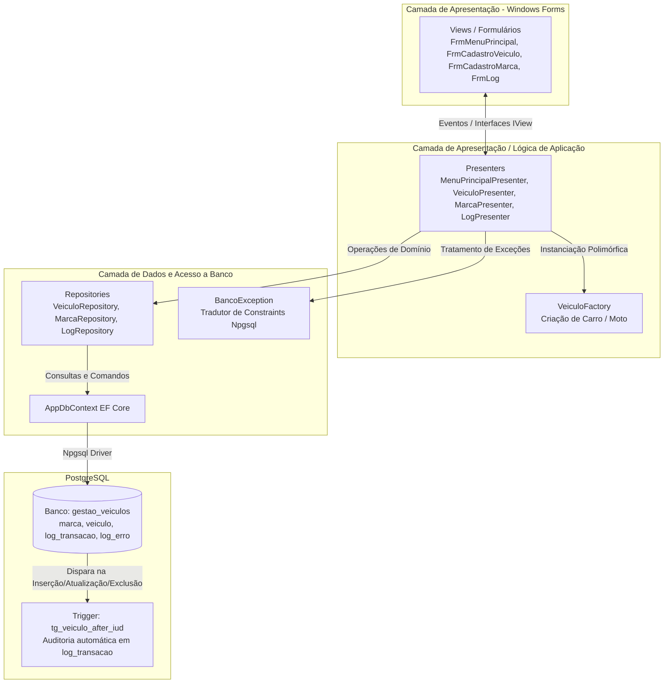

# Gestão de Veículos - Sistema de Cadastro e Controle

[](https://dotnet.microsoft.com/)
[](https://learn.microsoft.com/dotnet/desktop/winforms/)
[](https://www.postgresql.org/)
[](https://learn.microsoft.com/ef/core/)
[](https://nunit.org/)

Aplicação desktop profissional para gestão, auditoria e controle de veículos e marcas desenvolvida em **C#** e **Windows Forms** sobre a plataforma **.NET 10**. O sistema implementa uma arquitetura modular baseada em **MVP (Model-View-Presenter)**, **Repository Pattern**, **Factory Method**, auditoria automatizada em banco de dados via **Triggers PL/pgSQL** no **PostgreSQL** e tratamento centralizado de constraints com **BancoException**.

---

## 📌 Sumário

1. [Sobre o Projeto](#-sobre-o-projeto)
2. [Funcionalidades Principais](#-funcionalidades-principais)
3. [Tecnologias Utilizadas](#-tecnologias-utilizadas)
4. [Pré-requisitos](#-pré-requisitos)
5. [Configuração do Banco de Dados (PostgreSQL)](#-configuração-do-banco-de-dados-postgresql)
   - [Criação e Carga via CLI (psql)](#criação-e-carga-via-cli-psql)
   - [Configuração da Connection String (`appsettings.json`)](#configuração-da-connection-string-appsettingsjson)
6. [Compilação e Execução](#-compilação-e-execução)
7. [Testes Automatizados](#-testes-automatizados)
8. [Decisões Técnicas e Padrões de Projeto](#-decisões-técnicas-e-padrões-de-projeto)

---

## 📖 Sobre o Projeto

O **Gestão de Veículos** foi concebido como uma solução desktop robusta, desacoplada e de fácil manutenção para gerenciamento de frotas e marcas de veículos. 

A aplicação foi estruturada seguindo rigorosos padrões de engenharia de software para garantir separação de responsabilidades (SoC), testabilidade unitária das regras de negócio através de mocks, consistência transacional e auditoria completa de alterações em nível de banco de dados.

### 🚗 Funcionalidades Principais

- **Gestão de Veículos**:
  - Cadastro, listagem, edição e exclusão de veículos polimórficos (`Carro` e `Moto`).
  - Associação obrigatória com marca cadastrada.
  - Validações de domínio: formato e unicidade de placa, intervalo de ano de fabricação (1950 até o ano corrente) e integridade de modelo.
  - Instanciação desacoplada de tipos de veículo via **Factory Method** (`VeiculoFactory`).
- **Gestão de Marcas**:
  - Cadastro e listagem de marcas com garantia de unicidade de nome e validação de preenchimento.
- **Auditoria e Logs de Transação**:
  - Rastreabilidade de operações de `INSERT`, `UPDATE` e `DELETE` em veículos gravadas automaticamente via Trigger PL/pgSQL na tabela `log_transacao`.
  - Visualização gráfica de histórico de transações com data/hora e tipo de operação.
- **Rastreamento de Falhas (Logs de Erro)**:
  - Captura e persistência dinâmica de exceções e erros de integridade com data/hora, mensagem amigável, local da ocorrência, código de erro e stack trace.

---

## 🛠 Tecnologias Utilizadas

| Componente | Tecnologia | Versão | Finalidade |
| :--- | :--- | :--- | :--- |
| **Plataforma / Runtime** | [.NET SDK](https://dotnet.microsoft.com/) | 10.0 (net10.0-windows) | Runtime e SDK base da aplicação |
| **Linguagem** | C# | 14 / Latest | Linguagem de programação fortemente tipada |
| **Interface Gráfica** | Windows Forms (WinForms) | .NET 10 | Interface de usuário desktop |
| **Banco de Dados** | [PostgreSQL](https://www.postgresql.org/) | 14+ / 16+ | SGDB relacional para persistência e triggers |
| **Driver / Provider** | [Npgsql](https://www.nuget.org/packages/Npgsql) | 10.0.3 | Driver ADO.NET de alta performance para PostgreSQL |
| **ORM** | [Entity Framework Core](https://learn.microsoft.com/ef/core/) | 10.0.11 | Mapeamento objeto-relacional e queries |
| **Convenção de Nomes** | [EFCore.NamingConventions](https://www.nuget.org/packages/EFCore.NamingConventions) | 10.0.1 | Mapeamento automático em `snake_case` |
| **Configuração** | Microsoft.Extensions.Configuration | 10.0.12 | Leitura dinâmica do arquivo `appsettings.json` |
| **Testes Unitários** | [NUnit](https://nunit.org/) | 4.6.1 | Framework de testes unitários |
| **Mocking / Test Doubles** | [NSubstitute](https://nsubstitute.github.io/) | 6.2.0 | Biblioteca para mocks e asserções de chamadas |
| **Test Runner / SDK** | Microsoft.NET.Test.Sdk | 17.14.0 | Execução de testes via CLI e IDEs |

---

## 📋 Pré-requisitos

Antes de iniciar a configuração e execução, certifique-se de que seu ambiente atende aos seguintes requisitos:

1. **Sistema Operacional**: Windows 10 (versão 1809+) ou Windows 11 *(obrigatório para execução de aplicações Windows Forms .NET)*.
2. **.NET 10 SDK**:
   - Faça o download e instale o [.NET 10 SDK](https://dotnet.microsoft.com/download/dotnet/10.0).
   - Verifique a instalação no terminal:
     ```powershell
     dotnet --version
     # Deve exibir uma versão 10.0.xxx
     ```
3. **PostgreSQL Server (14, 15, 16 ou superior)**:
   - Servidor PostgreSQL instalado e em execução (localmente na porta padrão `5432` ou em servidor acessível).
   - Ferramenta de administração de banco de dados (`psql` via terminal ou interface gráfica `pgAdmin 4` / `DBeaver`).

---

## 🗄 Configuração do Banco de Dados (PostgreSQL)

O banco de dados relacional utiliza o script unificado DDL/DML localizado em `Database/script_criacao.sql`. Esse script cria todas as tabelas, constraints de unicidade e validação, a função de auditoria PL/pgSQL, a trigger e insere os registros iniciais (seed de marcas).

### Criação e Carga via CLI (`psql`)

1. Abra o PowerShell ou terminal do Windows na raiz do projeto:
   ```powershell
   cd "C:\Projetos Pessoais\GestaoVeiculos"
   ```

2. Crie o banco de dados `gestao_veiculos`:
   ```powershell
   psql -U postgres -h localhost -p 5432 -c "CREATE DATABASE gestao_veiculos;"
   ```
   *(Informe a senha do usuário `postgres` quando solicitado)*

3. Execute o script de criação e carga de dados apontando diretamente para o arquivo `Database/script_criacao.sql`:
   ```powershell
   psql -U postgres -h localhost -p 5432 -d gestao_veiculos -f Database/script_criacao.sql
   ```

### Configuração da Connection String (`appsettings.json`)

Verifique e ajuste, se necessário, as credenciais de acesso ao PostgreSQL no arquivo `GestaoVeiculos/appsettings.json`:

```json
{
  "ConnectionStrings": {
    "DefaultConnection": "Host=localhost;Port=5432;Database=gestao_veiculos;Username=postgres;Password=postgres"
  }
}
```

> 💡 **Nota**: Caso o seu PostgreSQL local utilize uma porta diferente de `5432`, outro usuário ou senha distinta de `postgres`, atualize os respectivos parâmetros em `DefaultConnection` para que a aplicação consiga se conectar perfeitamente.

---

## 🚀 Compilação e Execução

1. **Restaurar dependências e compilar a solução**:
   ```powershell
   dotnet build GestaoVeiculos.slnx
   ```

2. **Executar a aplicação Windows Forms**:
   ```powershell
   dotnet run --project GestaoVeiculos/GestaoVeiculos.csproj
   ```

---

## 🧪 Testes Automatizados

O projeto conta com uma suíte de testes unitários automatizados em `GestaoVeiculos.Tests`, desenvolvida com **NUnit** e **NSubstitute**. Os testes validam as regras de negócio dos Presenters simulando a camada de visualização (`IVeiculoView`) e os repositórios (`IVeiculoRepository`, `IMarcaRepository`, `ILogRepository`) através de mocks e test doubles.

### Executando os Testes via CLI

Na raiz do repositório, execute o comando:

```powershell
dotnet test
```

Para uma saída detalhada no terminal com o nome de cada teste executado:

```powershell
dotnet test --logger "console;verbosity=detailed"
```

### Cenários Cobertos

| Classe de Teste | Método / Cenário | Regra de Negócio Validada |
| :--- | :--- | :--- |
| `VeiculoPresenterTests` | `Cadastrar_AnoMenorQue1950_DeveExibirMensagemDeErro` | Garante que veículos com ano de fabricação inferior a 1950 disparam mensagem de erro e não são persistidos. |
| `VeiculoPresenterTests` | `Cadastrar_PlacaObrigatoria_DeveExibirMensagemDeErro` | Valida a obrigatoriedade do preenchimento da placa antes de prosseguir com o cadastro. |
| `VeiculoPresenterTests` | `Cadastrar_PlacaJaExistenteNoBanco_DeveExibirMensagemDeErro` | Assegura que violações de duplicidade de placa tratadas por `BancoException` sejam convertidas em mensagens amigáveis na View. |

---

## 🏛 Decisões Técnicas e Padrões de Projeto



### 1. Padrão MVP (Model-View-Presenter)
Para evitar o acoplamento excessivo comum em aplicações Windows Forms tradicionais (onde regras de negócio residem dentro do code-behind dos formulários), adotou-se o padrão **MVP**:
- **Views**: Contêm unicamente componentes visuais e disparam eventos de interface (`ClickBtnCadastrar`, `ClickBtnEditar`, etc.), implementando interfaces desacopladas (`IVeiculoView`, `IMarcaView`, `ILogView`, `IMenuPrincipalView`).
- **Presenters**: Concentram a orquestração do fluxo de telas, chamada aos repositórios e tratamento de retorno, recebendo as interfaces de View e Repository via injeção por construtor. Isso permite **100% de testabilidade unitária** sem carregar janelas do sistema operacional nos testes.
- **Models / DTOs**: Estruturas de dados fortemente tipadas (`Veiculo`, `Carro`, `Moto`, `Marca`, `VeiculoDTO`).

### 2. Factory Method (`VeiculoFactory`)
A instanciação de tipos de veículo (`Carro` e `Moto`) é encapsulada na classe `VeiculoFactory`. O Presenter apenas delega o tipo selecionado na View (`"Carro"` ou `"Moto"`) para a factory, garantindo que novas variantes de veículos possam ser adicionadas no futuro respeitando o princípio Aberto/Fechado (*Open/Closed Principle* do SOLID).

### 3. Repository Pattern com Entity Framework Core
O acesso a dados é isolado através de interfaces de repositório (`IVeiculoRepository`, `IMarcaRepository`, `ILogRepository`):
- O `AppDbContext` configura automaticamente o mapeamento de entidades para tabelas PostgreSQL utilizando a extensão `EFCore.NamingConventions` (garantindo nomes em *snake_case* compatíveis com scripts SQL).
- Consultas de leitura utilizam `AsNoTracking()` para máxima performance.

### 4. Tratamento Centralizado de Constraints (`BancoException`)
Erros originados pelo PostgreSQL durante transações (como violações de chave única, chave estrangeira, checks ou valores nulos) disparam `PostgresException` empacotadas em `DbUpdateException`. 

A classe estática `BancoException` intercepta esses códigos de erro (`PostgresErrorCodes`) e retorna mensagens claras e amigáveis ao usuário final:
- `23505 (Unique Violation)`: Identifica qual campo foi duplicado (ex: placa já existente ou marca duplicada).
- `23514 (Check Violation)`: Informa quando um valor está fora da faixa permitida (ex: ano entre 1950 e ano atual).
- `23503 (Foreign Key Violation)`: Notifica sobre registros vinculados que impedem exclusão ou chaves inválidas.
- `23502 (Not Null Violation)`: Informa qual campo obrigatório não foi preenchido.
- `08001 / 08006 (Connection Exceptions)`: Alerta sobre falha de comunicação com o servidor PostgreSQL.

### 5. Auditoria Automatizada via Triggers PL/pgSQL
A rastreabilidade de dados foi implementada diretamente no motor do banco de dados através da trigger `tg_veiculo_after_iud` e da função `tg_fn_veiculo_auditoria()`:
- Qualquer operação de `INSERT`, `UPDATE` ou `DELETE` na tabela `veiculo` gera imediatamente um registro na tabela `log_transacao` com o tipo de operação, data/hora exata do servidor e o identificador do veículo modificado.
- Isso assegura conformidade e auditoria inviolável, mesmo caso dados sejam manipulados externamente por scripts administrativos.

### 6. Justificativa Técnica do Uso da Tabela `log_erro`

> **Nota Arquitetural sobre o Registro de Erros:**  
> Mesmo sabendo que esta abordagem não é usual e que não seria aplicavelmente ideal em produção, o uso da tabela "log_erro" no banco de dados foi uma decisão focada em deixar o controle e o histórico dos erros mais dinâmico neste projeto. O ideal seria um arquivo .txt ou armazenamento em logs de servidor como demanda o padrão comercial.

---

Desenvolvido para avaliação técnica de desenvolvimento de software em .NET / C#.
